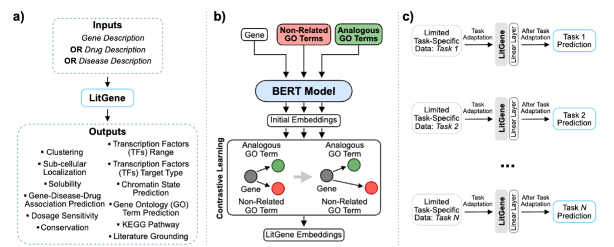
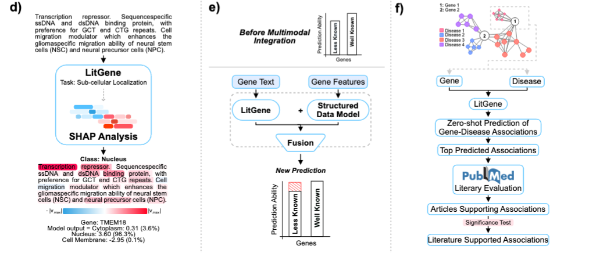
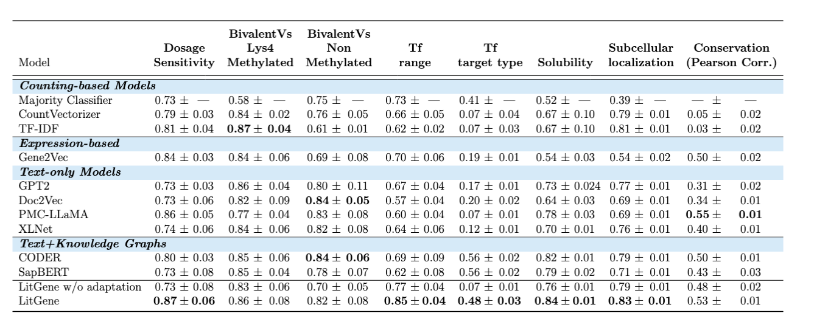
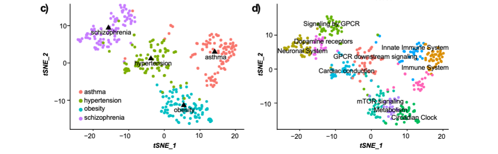
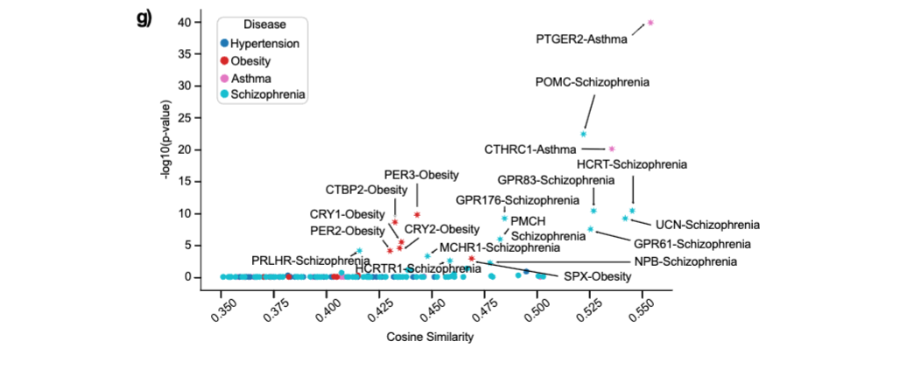
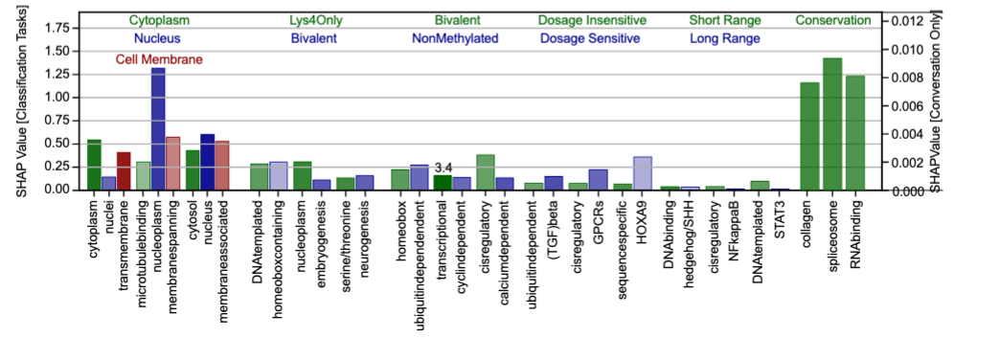

<h1 align="center">🧬 LitGene</h1> 
<a href="https://doi.org/10.5281/zenodo.22047782"></a>
<h3 align="center">An Interpretable Transformer Model Integrating Text and Ontology for Gene Representation Learning</h3>

<p align="center">
  📄 <a href="https://www.biorxiv.org/content/10.1101/2024.08.07.606674v2.abstract" target="_blank">Paper</a> •
  🤗 <a href="https://huggingface.co/tumorailab/LitGene_ContrastiveLearning" target="_blank">Model</a> •
  📂 <a href="https://huggingface.co/datasets/tumorailab/LitGeneGOTERMS" target="_blank">Dataset</a> •
  🌐 <a href="https://litgene.tumorai.org" target="_blank">Website</a>
</p>

<p align="center">
  <a href="https://github.com/vinash85/LitGene/blob/main/LICENSE">
    
  </a>
  <a href="https://huggingface.co/datasets/tumorailab/LitGeneGOTERMS">
    
  </a>
</p>

---

## 🧠 Architecture Overview




**LitGene** is an interpretable large language model tailored for gene-related tasks. It begins with textual summaries describing individual genes, which are encoded using a biomedical language model (PubMedBERT). These embeddings are refined through contrastive learning guided by Gene Ontology (GO) annotations, bringing semantically related genes closer in the embedding space and separating unrelated ones.

Once trained, the embeddings can be used for downstream tasks (e.g., predicting solubility or subcellular localization) through simple linear heads. Importantly, LitGene includes mechanisms for model interpretability (e.g., SHAP values) and supports zero-shot inference by projecting custom inputs (e.g., diseases, abstracts) into the same space.

LitGene is designed to complement — not replace — sequence- or expression-based models by offering biologically meaningful insights from literature. It can integrate with such models to enhance accuracy, reveal hidden biases, and identify novel associations.

Users can interact with LitGene via a public interface to query gene-disease-drug relationships, supported by citation-based validation.

---

## ✨ Key Features

- **Text-based gene embeddings** trained using PubMedBERT on gene descriptions  
- **GO-guided contrastive learning** to inject biological structure into embeddings  
- **Downstream transferability** to 8+ gene-level classification/regression tasks  
- **SHAP interpretability** for feature importance at word level  
- **Zero-shot generalization** to disease and drug associations  
- **Integration-ready** with sequence and expression data for improved performance  
- **Literature-grounded evaluation** to link predictions with scientific articles  
- **Public demo interface** for exploring predictions interactively  

---

## 🛠️ Installation and Usage

### Setup environment

```bash
git clone https://github.com/vinash85/LitGene.git
cd LitGeneUpdate
conda env create --name LitGene --file dependencies/conda/requirements.yml
conda activate LitGene
```

### Train LitGene with Contrastive Learning

```bash
python train_contrastive.py \
  --epochs 10 \
  --batch_size 50 \
  --lr 3e-5
```

### Evaluate on Downstream Task (e.g., Solubility)

```bash
python run_task.py \
  --task_type classification \
  --data_path data/combined_solubility.csv
```

---

## ⚙️ Hyperparameters

| Argument            | Default                                                         | Description                             |
| ------------------- | --------------------------------------------------------------- | --------------------------------------- |
| `--epochs`          | `1 for CL` and `5 for fine-tuning`                              | Training epochs                         |
| `--lr`              | `3e-5`                                                          | Learning rate                           |
| `--batch_size`      | `50`                                                            | Training batch size                     |
| `--pool`            | `"mean"`                                                        | Pooling strategy                        |
| `--max_length`      | `512`                                                           | Max token length                        |
| `--model_name`      | `microsoft/BiomedNLP-PubMedBERT-base-uncased-abstract-fulltext` | Pretrained encoder                      |
| `--data_path`       | `data/combined_solubility.csv`                                  | Path to CSV dataset                     |
| `--task_type`       | `"classification"`                                              | Task type: classification or regression |
| `--test_split_size` | `0.15`                                                          | Test set proportion                     |
| `--val_split_size`  | `0.15`                                                          | Validation set proportion               |
| `--save_model_path` | -                                                               | Where to store model checkpoint         |
| `--start_model`     | -                                                               | Path for the CL to resume from that checkpoint        |

---

## 📊 Results

### Generalization to Gene-Level Prediction Tasks

LitGene achieves state-of-the-art performance across eight gene-level tasks, including solubility, transcription factor targeting, localization, and conservation. It consistently outperforms strong baselines such as Gene2Vec, SapBERT, and PMC-LLaMA, ranking first in 7 out of 8 benchmarks. The model demonstrates robust generalization from text to biology, particularly excelling on tasks where literature-derived semantics offer unique advantages.



---

### 🧬 Zero-Shot Gene–Disease Association

LitGene effectively identifies disease-associated genes in a zero-shot setting by comparing cosine similarities between gene and disease embeddings. Without explicit training on disease labels, it clusters genes into meaningful disease-specific groups and uncovers enriched pathways, highlighting its capability for hypothesis generation.



---

### 📚 Literature-Grounded Validation

To ensure its predictions are not only computationally plausible but also supported by existing research, LitGene links gene and article embeddings, uncovering aligned thematic clusters. Enrichment tests confirm statistically significant overlap between predicted gene groups and topic-specific biomedical publications.



---

### 🔍 Interpretability and Bias Reduction

SHAP-based analysis reveals which words most influence LitGene’s predictions for various gene tasks. The model also narrows performance gaps between well-studied and underrepresented genes, improving fairness and offering insights into model decision-making via interpretable word-level attributions.



---

## 🗓️ Citation

```bibtex
@article {Jararweh2024.08.07.606674,
    author = {Jararweh, Ala and Macaulay, Oladimeji and Arredondo, David and Oyebamiji, Olufunmilola M and Hu, Yue and Tafoya, Luis and Zhang, Yanfu and Virupakshappa, Kushal and Sahu, Avinash},
    title = {LitGene: a transformer-based model that uses contrastive learning to integrate textual information into gene representations},
    elocation-id = {2024.08.07.606674},
    year = {2024},
    doi = {10.1101/2024.08.07.606674},
    publisher = {Cold Spring Harbor Laboratory},
    URL = {https://www.biorxiv.org/content/early/2024/08/08/2024.08.07.606674},
    eprint = {https://www.biorxiv.org/content/early/2024/08/08/2024.08.07.606674.full.pdf},
    journal = {bioRxiv}
}
```

---

<p align="center">
  💬 For questions, feel free to open an issue or contact the authors directly via email or the <a href="https://litgene.tumorai.org">project site</a>.
</p>
